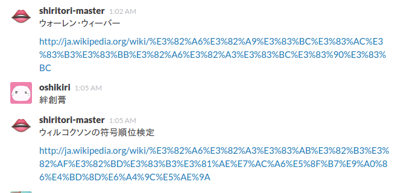

shirimas: shiritori-master
===============

**Slack用しりとりbot**

しりとりをする相手が居ない場合でも，以下のようにSlack上でのしりとりが楽しめます．

## 特徴

- **MeCab**を利用して読みを取得
- デフォルトではWikipediaの数学関係やその他もろもろの記事から取得した**マニアックな**単語候補を使う
- しりとりが行われているチャンネルで**既出の単語は(できるかぎり)発言しない**
- 単語と一緒にWikipediaの記事を紹介してくれるので勉強になる

## 作成したもの
`*.py`はPython3.4.2で作成

### autoexec.py
数秒ごとに main_shiritori.py を実行する

### main_shiritori.py
shirimasのmain関数

### ShiriMas.py
shirimas用ライブラリ

### shiritori-hitory.sqlite
shiritoriチャンネルの履歴

### parse_wiki.py
wikipediaのデータから単語候補を抽出する

(これだけPython2.7.6で作成．いつか書きなおす)

### wikidata.csv
parse_wiki.py で生成したデータ

## 依存関係

- SlackBot.py
